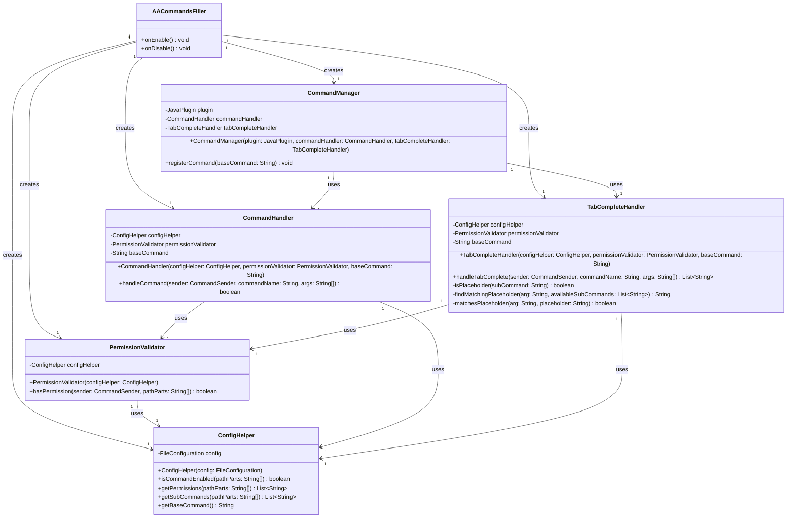

# AACommandsFiller

A Minecraft Paper plugin that dynamically generates tab-completions for hierarchical command structures defined in config.yml, with permission-based filtering for command visibility.

## Features

- **Dynamic command registration** - No plugin.yml needed
- **Hierarchical command structures** - Define nested subcommands
- **Permission-based filtering** - Commands only show to players with the right permissions
- **Smart placeholder matching** - Supports `<number>`, `<playername>`, `<+/-><modifier>`, and custom patterns
- **Flexible permission system** - Single or multiple permissions per command (OR logic)

## Architecture

The plugin follows a modular architecture with clear separation of concerns:



*View the [UML source file](UML-Diagram.mmd) for editing*

## Dependencies

| Dependency | Required |
|---|---|
| [Paper](https://papermc.io/) 1.21+ | Yes |
| [Spigot](https://www.spigotmc.org/) 1.21+ | Yes |

## Installation

1. Place `AACommandsFiller.jar` into your server's `plugins/` folder
2. Start or reload the server (**WILL NOT WORK WITH PLUGMANX**)
3. Configure `plugins/AACommandsFiller/config.yml` as needed
4. Restart the server

## Configuration

### Basic Structure

```yaml
# Base command name (e.g., tfmc will create /tfmc)
base-command: tfmc

# ========================================
# COMMANDS - Define your command structure
# ========================================
commands:
  # Simple command
  help: {}
  
  # Nested commands
  roll:
    strength: {}
    dexterity: {}
    <number>:
      <+/-><modifier>: {}
  
  # Staff commands
  ban:
    <playername>:
      <reason>: {}

# ========================================
# PERMISSIONS - Control who can see what
# ========================================
permissions:
  # Single permission
  ban: tfmc.staff
  
  # Multiple permissions (OR logic - player needs ANY)
  helper: [tfmc.helper, tfmc.admin]
```

### Placeholder Patterns

The plugin recognizes these placeholder patterns:

| Pattern | Matches | Example |
|---|---|---|
| `<number>` | Any integer (positive or negative) | 10, -5, 100 |
| `<amount>` | Any integer (positive or negative) | 50, 1000, -10 |
| `<+/-><modifier>` or contains `modifier` | +/- followed by integer | +5, -3, +12 |
| `<playername>`, `<player>`, `<name>` | Any non-empty text | Steve, Alex, Player123 |
| `<reason>`, `<message>`, `<text>` | Any non-empty text | Griefing, Spam, Hello |
| Any other `<custom>` placeholder | Any non-empty text | (default behavior) |

**Note:** Pattern matching is case-insensitive. If the placeholder name contains any of the keywords above (e.g., `<player_name>` contains "player"), it will use that pattern's matching rules.

### Permission Examples

**Public command (no permission):**
```yaml
commands:
  help: {}
# Don't add to permissions section
```

**Single permission:**
```yaml
permissions:
  ban: tfmc.staff
```

**Multiple permissions (OR logic):**
```yaml
permissions:
  kick: [tfmc.moderator, tfmc.admin]
```

**Nested command permissions:**
```yaml
permissions:
  helper: tfmc.helper
  helper.promote: tfmc.helper.senior  # More restrictive
```

## How It Works

1. **Config Loading** - `ConfigHelper` reads command structure and permissions
2. **Permission Caching** - Permissions are indexed for fast lookups
3. **Command Registration** - `CommandManager` registers the base command via reflection
4. **Tab Completion** - `TabCompleteHandler` filters suggestions by:
   - What exists in config
   - What the player has permission to see
   - What matches the current input
   - What placeholder patterns match
5. **Validation** - `PermissionValidator` checks if player has required permissions (OR logic for multiple)

## Example Use Cases

### Dice Rolling System
```yaml
commands:
  roll:
    strength: {}
    dexterity: {}
    <number>:
      <+/-><modifier>: {}
```
- `/tfmc roll strength` → Roll strength
- `/tfmc roll 10` → Shows `<+/-><modifier>`
- `/tfmc roll 10 +5` → Roll d10 with +5 modifier

### Staff Commands / Permissions
```yaml
commands:
  ban:
    <playername>:
      <reason>: {}
  kick:
    <playername>: {}

permissions:
  ban: tfmc.staff
  kick: [tfmc.moderator, tfmc.admin]
```
- `/tfmc ban PlayerName Griefing` → Staff only
- `/tfmc kick PlayerName` → Mods or admins

## Author

Justin - TFMC
[Donation Link](https://www.patreon.com/c/TFMCRP)
